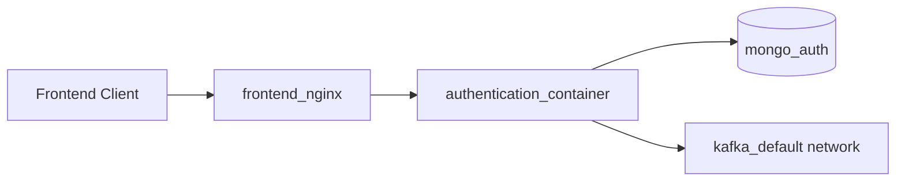
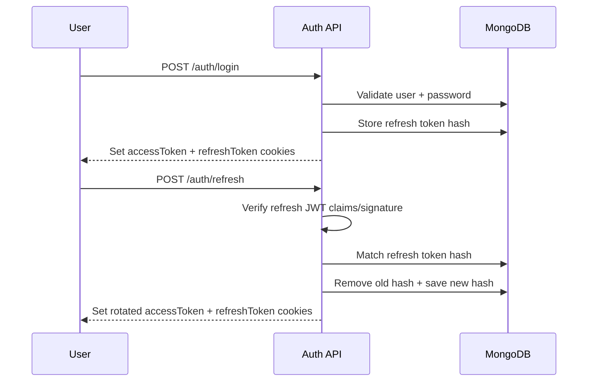
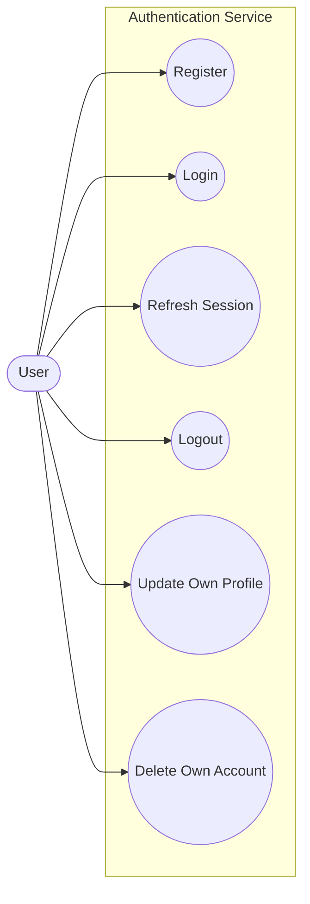
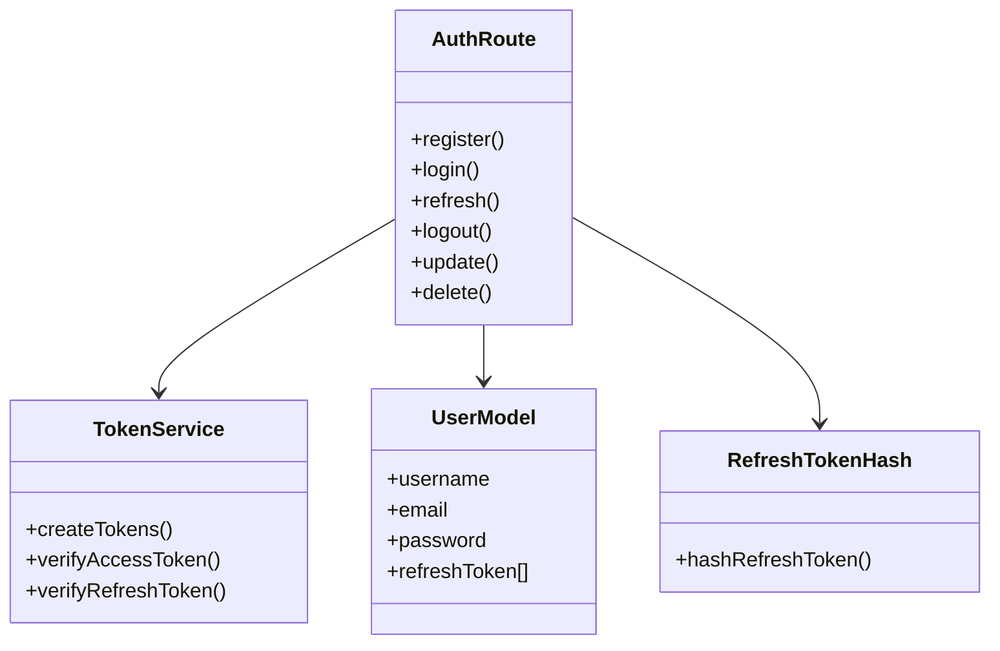
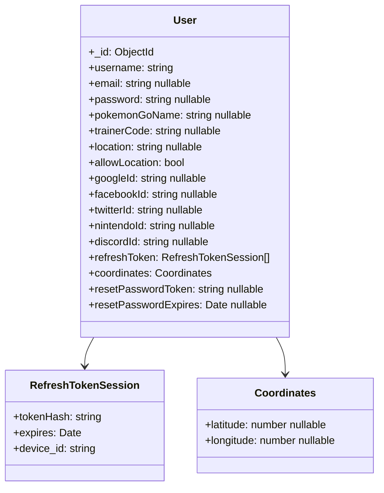

# Authentication Service (Node.js) 🔒

Authentication API for Pokemon Go Nexus.

## 📌 Overview

This service handles:

- Account registration and login
- JWT access/refresh token issuance
- Refresh token rotation and logout
- Account update and delete (owner-only)
- Transitional trade reveal endpoint
- Daily MongoDB backup task (`mongodump`)

## ✅ Current Scope

- OAuth/social login is intentionally disabled.
- Email delivery is intentionally disabled.
- Password reset completion is intentionally disabled (`501` by design).
- Cookie-authenticated mutating routes enforce Origin checks.
- Refresh tokens are stored as one-way hashes and rotated on refresh.
- `tradeRevealRoute` is transitional and can be removed after replacement.

## 🧭 API Routes

Mounted under `/auth`:

| Method | Route | Notes |
| --- | --- | --- |
| `POST` | `/auth/register` | Creates account + issues cookies |
| `POST` | `/auth/login` | Issues access + refresh cookies |
| `POST` | `/auth/refresh` | Verifies refresh JWT + hash, rotates both tokens |
| `POST` | `/auth/logout` | Revokes current refresh session |
| `PUT` | `/auth/update/:id` | Requires auth, owner-only |
| `DELETE` | `/auth/delete/:id` | Requires auth, owner-only |
| `POST` | `/auth/reset-password/` | Intentionally disabled (`501`) |
| `POST` | `/auth/reveal-partner-info` | Transitional endpoint |

Other routes:

- `GET /api-docs`
- `GET /healthz`
- `GET /readyz`

## ⚙ Environment Variables

### Required

- `DATABASE_URL` MongoDB connection string
- `JWT_SECRET` base JWT secret (fallback)

### Recommended

- `FRONTEND_URL` CORS frontend origin (for example `http://localhost:3000`)
- `NODE_ENV` (`development` or `production`)
- `ACCESS_TOKEN_SECRET` optional dedicated secret for access tokens
- `REFRESH_TOKEN_SECRET` optional dedicated secret for refresh tokens
- `JWT_ISSUER` optional JWT issuer (default `pokemongonexus-auth`)
- `JWT_AUDIENCE` optional JWT audience (default `pokemongonexus-clients`)

## 🏗 Architecture (Mermaid)

### Service Context



### Login + Refresh Rotation Flow



## 📐 UML Diagrams

| Diagram | Purpose |
| --- | --- |
| Use Case | High-level user interactions with auth endpoints |
| Class | Core modules and relationships in the service |
| User Model | Full persisted `User` document shape in MongoDB |

### Use Case (Mermaid UML)



### Class Summary (Table)

| Class | Key Members | Responsibility |
| --- | --- | --- |
| `AuthRoute` | `register`, `login`, `refresh`, `logout`, `update`, `delete` | Handles auth HTTP routes and orchestration |
| `TokenService` | `createTokens`, `verifyAccessToken`, `verifyRefreshToken` | JWT generation and validation |
| `UserModel` | `username`, `email`, `password`, `refreshToken[]` | Persisted user account model |
| `RefreshTokenHash` | `hashRefreshToken` | One-way hashing of refresh tokens |

### Class View (Mermaid UML)



### User Persistence Model (Mermaid UML)



Constraints:

- `username` is required, unique, min length 3, max length 36.
- `email` is unique when present, min length 6, max length 255.
- `trainerCode` must be 12 digits when present and is unique via partial index.
- `pokemonGoName` is unique when present via partial index.
- Empty-string normalization in pre-save middleware converts string fields like `pokemonGoName`, `trainerCode`, and social IDs to `null`.

## 🧪 Local Development

```bash
cd Go/authentication
npm ci
npm start
```

Dev mode:

```bash
npm run dev
```

Tests:

```bash
npm test
```

## 🐳 Docker

```bash
cd Go/authentication
docker compose up -d
```

Notes:

- Uses `mongo:6` for local compose DB.
- Container includes `mongodb-tools` for backup tasks.
- Service runs as non-root user `adam` in container.
- MongoDB is not host-exposed by default.
- Auth host exposure is loopback-only (`127.0.0.1:3002`).

## 🚀 Production Deploy (Manual CD)

Workflow:

- `deploy-auth-prod`

Manual inputs:

- `image_ref` (for example `latest` or `sha-<commit>`)
- `deploy_root` (default `/media/adam/storage/Code/Go`)
- `service_name` (default `auth_service`)

Deploy behavior:

- Syncs prod repo to selected branch
- Validates `authentication/.env` keys (`DATABASE_URL`, `JWT_SECRET`)
- Ensures `kafka_default` network exists
- Pulls target image and recreates `auth_service`
- Health-checks with `GET /readyz` (`200` expected)
- Rolls back on failure (when previous image exists)

## 🛡 Security Notes

- Login uses generic invalid-credentials responses.
- Update/delete are owner-only and require auth.
- JWT verification enforces algorithm, issuer, and audience.
- Refresh token replay window is reduced by rotation + hash storage.

## 🧰 Maintenance Notes

- Inactive social auth dependencies were removed to reduce attack surface.
- Vulnerability remediation was applied at patch level where non-breaking.
- CI validates install, JS syntax, tests, audit gate, and container security scan.

