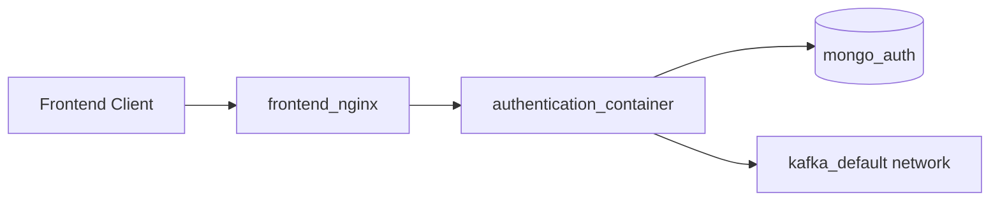
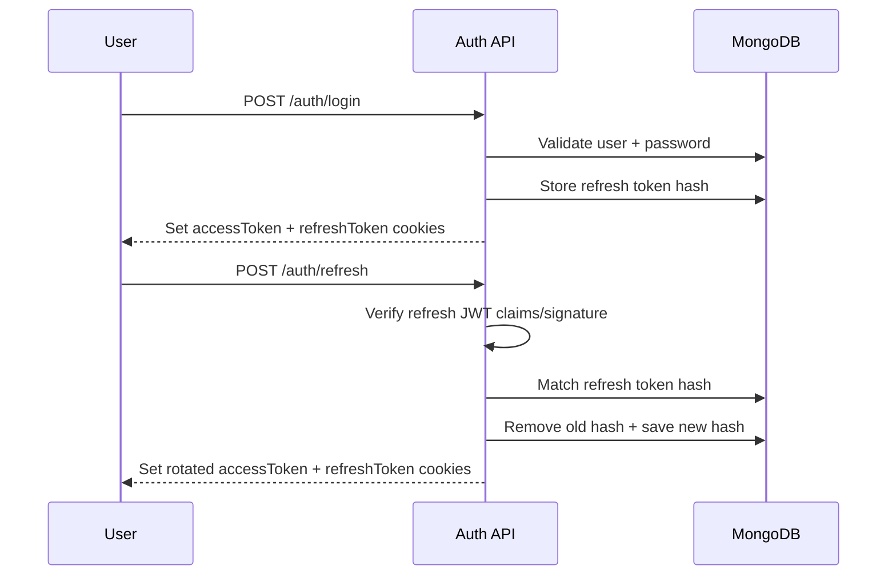
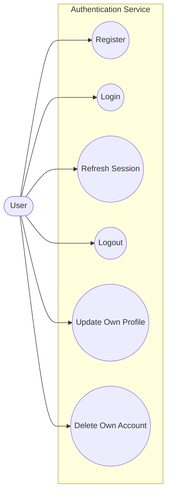
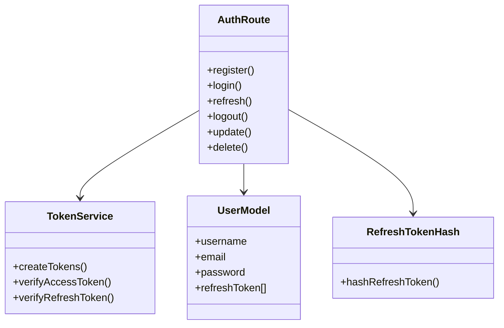
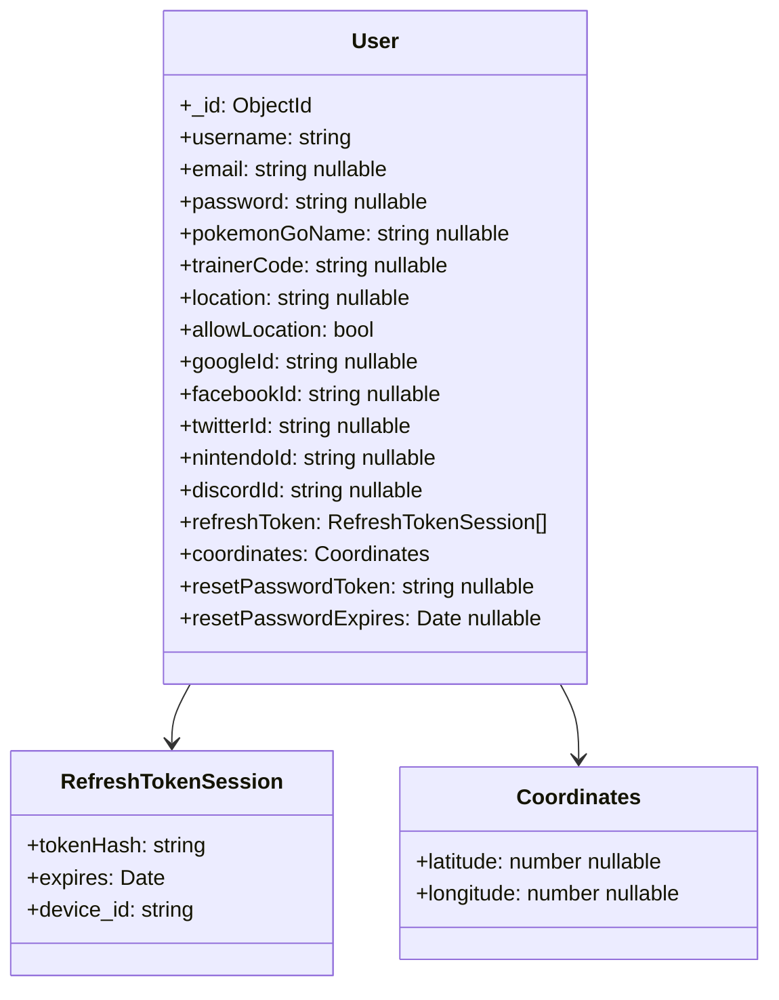

# Authentication Service (Node.js) 🔒

Authentication API for Pokémon Go Nexus.

## 📌 Overview

This service handles:

- Account registration and login
- JWT access/refresh token issuance
- Refresh token rotation and logout
- Verified email changes and password reset email delivery
- Google, Discord, and Facebook OAuth registration/login/linking
- One-use, device-bound OAuth provider linking for native clients
- Connected identity and all-session management
- Account update and delete (owner-only)
- Daily MongoDB backup task (`mongodump`)

## ✅ Current Scope

- Email/password and Google, Discord, and Facebook authentication are active.
- Password-reset and email-change messages are delivered through Resend.
- Password changes, resets, and verified email changes revoke existing sessions.
- Cookie-authenticated mutating routes enforce Origin checks.
- Refresh tokens are stored as one-way hashes and rotated on refresh.
- Trade authorization and partner reveal are owned by the MySQL users service.

## 🧭 API Routes

Mounted under `/auth`:

| Method | Route | Notes |
| --- | --- | --- |
| `POST` | `/auth/register` | Creates account + issues cookies |
| `POST` | `/auth/login` | Issues access + refresh cookies |
| `POST` | `/auth/refresh` | Verifies refresh JWT + hash, rotates both tokens |
| `POST` | `/auth/logout` | Revokes current refresh session |
| `PUT` | `/auth/update/:id` | Requires auth, owner-only |
| `DELETE` | `/auth/delete/:id` | Requires auth, owner-only |
| `POST` | `/auth/reset-password` | Sends a privacy-preserving reset email |
| `POST` | `/auth/reset-password/confirm` | Consumes a one-time reset token |
| `POST` | `/auth/email-change` | Sends verification to a proposed email |
| `POST` | `/auth/email-change/confirm` | Verifies the new email and revokes sessions |
| `GET` | `/auth/account/security` | Connected identities and active-session count |
| `POST` | `/auth/sessions/revoke-all` | Revokes all refresh sessions |
| `DELETE` | `/auth/account/identities/:provider` | Disconnects an OAuth identity safely |
| `POST` | `/auth/mobile/oauth/link/start` | Starts a recent-session, device-bound native link |
| `POST` | `/auth/mobile/oauth/link/exchange` | Consumes the one-use native callback result |

Other routes:

- `GET /api-docs`
- `GET /healthz`
- `GET /readyz`
- `GET /metrics`

## ⚙ Environment Variables

### Required

- `DATABASE_URL` MongoDB connection string
- `JWT_SECRET` base JWT secret (fallback)

### Recommended

- `FRONTEND_URL` CORS frontend origin (for example `http://localhost:3000`)
- `NODE_ENV` (`development` or `production`)
- `ACCESS_TOKEN_SECRET` optional dedicated secret for access tokens
- `REFRESH_TOKEN_SECRET` optional dedicated secret for refresh tokens
- `JWT_ISSUER` optional JWT issuer (default `pokemongonexus-auth`)
- `JWT_AUDIENCE` optional JWT audience (default `pokemongonexus-clients`)

### OAuth

Each provider requires its client ID, client secret, and callback URL:

- `GOOGLE_CLIENT_ID` OAuth 2.0 web client ID
- `GOOGLE_CLIENT_SECRET` OAuth 2.0 web client secret
- `GOOGLE_CALLBACK_URL` public callback URL, normally
  `https://pokegonexus.com/api/auth/google/callback`
- `OAUTH_STATE_SECRET` optional dedicated secret for short-lived OAuth state and
  onboarding cookies; falls back to `JWT_SECRET`

Equivalent `DISCORD_*` and `FACEBOOK_*` values configure those providers.

Native account linking keeps these same provider callback URLs. The callback
returns only a short-lived, one-use result code to
`pokegonexus://native/account`; the native client must exchange it using the
same user's bearer session and device ID. Access and refresh tokens are never
placed in browser or deep-link URLs. `MOBILE_OAUTH_REDIRECT_URI` may override
the app redirect URI for a controlled build environment.

Register this exact authorized redirect URI in Google Cloud. Local frontend
sessions may use the production HTTPS auth callback; the signed OAuth state
returns them only to an allow-listed frontend origin.

OAuth providers supply a verified account email. New users still choose a
Pokémon Go Nexus username and may add trainer/location details, but they do not
create a password. Registration rejects a verified provider email already owned
by an account. Login with a verified matching email authenticates that same
account and records the provider identity.

## 🏗 Architecture (Mermaid)

### Service Context


```mermaid
flowchart LR
  Client[Frontend Client] --> Nginx[frontend_nginx]
  Nginx --> Auth[authentication_container]
  Auth --> Mongo[(mongo_auth)]
  Auth --> KafkaNet[kafka_default network]
```

### Login + Refresh Rotation Flow


```mermaid
sequenceDiagram
  participant U as User
  participant A as Auth API
  participant D as MongoDB

  U->>A: POST /auth/login
  A->>D: Validate user + password
  A->>D: Store refresh token hash
  A-->>U: Set accessToken + refreshToken cookies

  U->>A: POST /auth/refresh
  A->>A: Verify refresh JWT claims/signature
  A->>D: Match refresh token hash
  A->>D: Remove old hash + save new hash
  A-->>U: Set rotated accessToken + refreshToken cookies
```

## 📐 UML Diagrams

| Diagram | Purpose |
| --- | --- |
| Use Case | High-level user interactions with auth endpoints |
| Class | Core modules and relationships in the service |
| User Model | Full persisted `User` document shape in MongoDB |

### Use Case (Mermaid UML)


```mermaid
flowchart LR
  User([User])
  subgraph AuthSvc[Authentication Service]
    UC1((Register))
    UC2((Login))
    UC3((Refresh Session))
    UC4((Logout))
    UC5((Update Own Profile))
    UC6((Delete Own Account))
  end
  User --> UC1
  User --> UC2
  User --> UC3
  User --> UC4
  User --> UC5
  User --> UC6
```

### Class Summary (Table)

| Class | Key Members | Responsibility |
| --- | --- | --- |
| `AuthRoute` | `register`, `login`, `refresh`, `logout`, `update`, `delete` | Handles auth HTTP routes and orchestration |
| `TokenService` | `createTokens`, `verifyAccessToken`, `verifyRefreshToken` | JWT generation and validation |
| `UserModel` | `username`, `email`, `password`, `refreshToken[]` | Persisted user account model |
| `RefreshTokenHash` | `hashRefreshToken` | One-way hashing of refresh tokens |

### Class View (Mermaid UML)


```mermaid
classDiagram
  class AuthRoute {
    +register()
    +login()
    +refresh()
    +logout()
    +update()
    +delete()
  }

  class TokenService {
    +createTokens()
    +verifyAccessToken()
    +verifyRefreshToken()
  }

  class UserModel {
    +username
    +email
    +password
    +refreshToken[]
  }

  class RefreshTokenHash {
    +hashRefreshToken()
  }

  AuthRoute --> TokenService
  AuthRoute --> UserModel
  AuthRoute --> RefreshTokenHash
```

### User Persistence Model (Mermaid UML)


```mermaid
classDiagram
  class User {
    +_id: ObjectId
    +username: string
    +email: string nullable
    +password: string nullable
    +pokemonGoName: string nullable
    +trainerCode: string nullable
    +location: string nullable
    +allowLocation: bool
    +googleId: string nullable
    +facebookId: string nullable
    +twitterId: string nullable
    +nintendoId: string nullable
    +discordId: string nullable
    +refreshToken: RefreshTokenSession[]
    +coordinates: Coordinates
    +resetPasswordToken: string nullable
    +resetPasswordExpires: Date nullable
  }

  class RefreshTokenSession {
    +tokenHash: string
    +expires: Date
    +device_id: string
  }

  class Coordinates {
    +latitude: number nullable
    +longitude: number nullable
  }

  User --> RefreshTokenSession
  User --> Coordinates
```

Constraints:

- `username` is required, unique, min length 3, max length 36.
- `email` is unique when present, min length 6, max length 255.
- `trainerCode` must be 12 digits when present and is unique via partial index.
- `pokemonGoName` is unique when present via partial index.
- Empty-string normalization in pre-save middleware converts string fields like `pokemonGoName`, `trainerCode`, and social IDs to `null`.

## 🧪 Local Development

```bash
cd Go/authentication
npm ci
npm start
```

Dev mode:

```bash
npm run dev
```

Tests:

```bash
npm test
```

## 🐳 Docker

```bash
cd Go/authentication
docker compose up -d
```

Notes:

- Uses `mongo:6` for local compose DB.
- Container includes `mongodb-tools` for backup tasks.
- Service runs as non-root user `adam` in container.
- MongoDB is not host-exposed by default.
- Auth host exposure is loopback-only (`127.0.0.1:3002`).

## 🚀 Production Deployment

The private HomeOps `deploy-pokegonexus-service` workflow deploys Auth. It
accepts only the current full PokeGoNexus `master` SHA, verifies the image's
embedded revision, deploys its immutable digest, checks `/readyz`, and rolls
back a failed replacement. This public repository never runs deployment code
on the production runner.

## 🛡 Security Notes

- Login uses generic invalid-credentials responses.
- Update/delete are owner-only and require auth.
- JWT verification enforces algorithm, issuer, and audience.
- Refresh token replay window is reduced by rotation + hash storage.

## 🧰 Maintenance Notes

- Inactive social auth dependencies were removed to reduce attack surface.
- Vulnerability remediation was applied at patch level where non-breaking.
- CI validates install, JS syntax, tests, audit gate, and container security scan.
