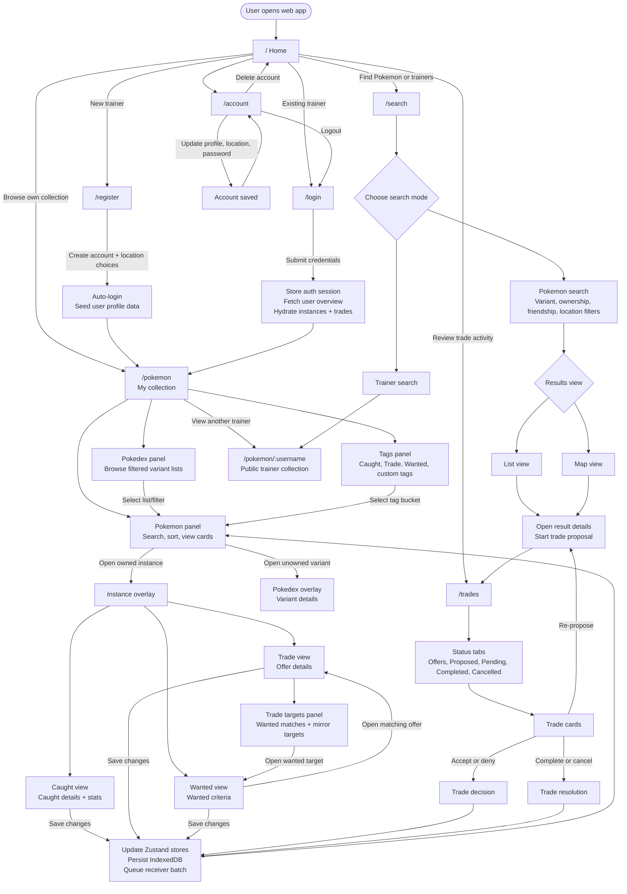

# PokeGo Nexus Frontend

This is the **React web frontend** for the PokeGo Nexus platform. It is the primary client for managing Pokémon ownership, proposing trades, maintaining wanted lists, browsing Pokédex data, searching trainers/Pokémon, and validating Safari/WebKit behavior before production deploys.

---

## 🧩 Overview

The app supports:

- Ownership tracking with caught/trade/wanted instance detail.
- Pokédex browsing, variant filtering, sorting, and tag-driven collection views.
- Trade proposal, mirror-trade targeting, status review, and trade resolution flows.
- Search and map-based discovery across Pokémon, ownership modes, friendship filters, locations, and trainers.
- Fusion, Mega, Crown, Max, background, costume, shiny, shadow, and other variant display rules.
- IndexedDB-backed boot performance, queued receiver updates, and SSE/missed-update syncing.

> The frontend is actively evolving. When changing behavior, add or update tests that lock down the user experience, especially around overlays, Safari/WebKit behavior, IndexedDB, touch gestures, and grid layout.

---

## 🗂 Monorepo Layout (Current)

- `frontend/packages/app-core/` → canonical app source (`src`), app public assets (`public`), HTML entry, and Vitest test source (`tests`).
- `frontend/apps/web/` → web host/build shell: Vite config, Playwright config, CI scripts, env files, and `dist` output.
- `frontend/apps/web/.artifacts/` → generated local/CI browser and test artifacts only.
- `frontend/packages/shared-contracts/` → shared API contracts and DTO types.
- `frontend/packages/shared-ui-tokens/` → shared design tokens and web CSS variables.
- repo-root `assets/` → canonical shared media/static asset source served by frontend nginx at `/media/...`.

---

## 🧭 User Flow Diagram

This diagram is intentionally a user-flow map, not a component dependency graph. Use it to understand where a trainer can go, what major choices they make, and which flows write back to local state, IndexedDB, or backend services.



### Reading Guide

- The main collection workflow lives at `/pokemon`, which has three horizontally sliding panels: Pokédex, Pokémon, and Tags.
- Opening a Pokémon card branches into either a Pokédex overlay for variant-only data or an instance overlay for owned/caught/trade/wanted data.
- Search is separate from collection management: it helps users discover Pokémon or trainers, then leads into trade proposals or public trainer collections.
- Trades are managed from `/trades` by status, with actions that write back through the same store, IndexedDB, and receiver update path used by instance edits.
- App bootstrapping, IndexedDB hydration, service worker batching, and SSE updates run behind these screens to keep variants, instances, tags, and trades current.

### Logged-In vs Logged-Out Feature Notes

The current app does not treat every route as a hard auth boundary. Instead, authentication mainly changes whether the user has a trainer identity, hydrated user-owned data, and permission to write changes.

| Feature area | Logged out | Logged in |
| --- | --- | --- |
| Home and navigation | Can view the landing page, browse public navigation, switch theme, and go to Login/Register. | Sees Account instead of Login/Register and can use the app as a known trainer. |
| Register/Login | Can create an account or sign in. | Login/register are no longer the main path; account management becomes available. |
| Account | No user profile is available. | Can edit profile details, location preferences, password, logout, or delete account. |
| `/pokemon` collection | Can browse Pokédex-style variant data, but user-owned instance data and durable edits depend on an authenticated user session. | Hydrates the trainer's instances, tags, and trades; supports editing caught/trade/wanted details, changing tags, and queueing updates. |
| `/pokemon/:username` public collection | Can view another trainer's public collection if the profile exists. | Same public viewing flow, while still retaining the logged-in user's own session and local data. |
| Search | Can use discovery-oriented search surfaces where backend endpoints allow it. Trade-oriented actions may be limited because there is no current trainer identity. | Can search Pokémon/trainers, inspect list or map results, and move into trade proposal flows as the current trainer. |
| Trades | May render empty or unauthenticated state because there is no user overview/trade store hydrated for the visitor. | Shows Offers, Proposed, Pending, Completed, and Cancelled trades; actions sync through trade stores and backend updates. |
| Background sync | No authenticated SSE stream or receiver batch identity. | Auth state is posted to the service worker; IndexedDB, queued receiver updates, and SSE/missed-update handling keep local data current. |

---

## ⚙️ Tech Stack

- **React 19** and **React Router 7** for the web app shell and route model.
- **Vite 8** for development, production builds, and preview-mode browser tests.
- **TypeScript 6** across app source and tests.
- **Zustand** for domain state stores: variants, instances, tags, trades, auth, users, and location.
- **React Context** for cross-cutting app concerns: auth API, theme, modal dialogs, loading overlay, and SSE events.
- **IndexedDB** via `idb` for variant, instance, tag, trade, and queued-update persistence.
- **Server-Sent Events** and receiver batching for real-time and offline-ish sync.
- **Vitest**, **Testing Library**, **Playwright**, **ESLint**, and **Stylelint** for quality gates.

---

## 🚀 Getting Started

### 1. Install dependencies

```bash
cd frontend
nvm use
npm ci
```

### 2. Configure environment

Use `frontend/apps/web/.env.development` for local API URLs and `frontend/apps/web/.env.production` for production build defaults. If you want local frontend work to hit live APIs, copy the production values into your local development env.

Restart Vite after changing `.env*` values.

### 3. Start the dev server

```bash
npm --workspace apps/web run dev
```

### 4. Run local checks

```bash
npm --workspace apps/web run lint
npm --workspace apps/web run typecheck
npm --workspace apps/web run test:unit
npm --workspace apps/web run test:browsers:safari
```

---

## 🎞️ Demo Media Capture

The live demo capture commands log in to the production web surface and use a read-only Playwright guard that blocks Pokémon, trade, and profile mutation requests. Auth session-token metadata may still change because the capture performs a normal login.

```bash
npm --workspace apps/web run capture:demo:live
npm --workspace apps/web run capture:demo:video:live
```

- Screenshots are written to `frontend/apps/web/.artifacts/demo-media-live/`.
- Videos are written to `frontend/apps/web/.artifacts/demo-video-live/`.
- Screenshots capture dark and light themes for desktop and mobile.
- Videos default to dark theme for desktop and mobile, matching the app default.
- Videos use a disposable warm-up page for login/cache priming, then record a fresh high-resolution page with paced 15-20 second app moments.
- Desktop videos include an in-page demo cursor because browser video capture does not record the operating-system cursor.
- Video capture suppresses notification toasts so location/auth messages do not cover the demo surface.

Video capture can be expanded when Phlosion or README embeds need more variants:

```bash
DEMO_VIDEO_THEMES=dark,light npm --workspace apps/web run capture:demo:video:live
DEMO_VIDEO_VIEWPORTS=desktop npm --workspace apps/web run capture:demo:video:live
DEMO_VIDEO_FLOWS=collection-overlay npm --workspace apps/web run capture:demo:video:live
DEMO_VIDEO_PAUSE_MS=4500 DEMO_VIDEO_FINAL_PAUSE_MS=8000 npm --workspace apps/web run capture:demo:video:live
```

Current video flows are `collection-overlay` and `search-results`. Keep dark media as the primary Phlosion surface, and expose light media as an alternate view when a page has room for a theme toggle.

---

## CI/CD (GitHub Actions)

This service now has dedicated frontend workflows:

- `ci-frontend` (`.github/workflows/ci-frontend.yml`)
- `deploy-frontend-prod` (`.github/workflows/deploy-frontend-prod.yml`)

### What `ci-frontend` does

- Runs on changes under `frontend/**`, `nginx/**`, and the frontend workflow files.
- Installs workspace deps with `npm ci` from `frontend/`.
- Builds with `npm run build`.
- Enforces a blocking production audit gate with `npm audit --omit=dev --audit-level=moderate`.
- Runs full (prod + dev) audit as informational output for visibility without blocking deploys.
- Builds nginx image after staging `frontend/apps/web/dist` into `nginx/build`.
- Runs Trivy scans and publishes an SBOM artifact.
- Pushes `adamwentworth/frontend-nginx` tags (`sha-<commit>` + `latest`) when `DOCKERHUB_TOKEN` is set.

### What `deploy-frontend-prod` does

- Manual trigger (`workflow_dispatch`) on your self-hosted prod runner.
- Uses the workflow checkout for compose definitions and keeps prod state under `deploy_root`.
- Runs the frontend image as a self-contained artifact; nginx config is not bind-mounted from the runner checkout.
- Validates compose and required Docker networks (`kafka_default`, `pokemon_edge`).
- Pulls requested image, deploys its resolved digest when available, and recreates `frontend_nginx` with rollback on failed health check.

### Deploy input examples

- `image_ref=latest`
- `image_ref=sha-<commit>`
- `image_ref=adamwentworth/frontend-nginx:sha-<commit>`

### Required repository secret

- `DOCKERHUB_TOKEN` (used by CI for DockerHub login/push)

---

## ⚙️ Environment Configuration

Set up API connection values in `frontend/apps/web/.env.*`.
If you're developing the frontend and don't need to run the backend locally, use production-style values to connect directly to the live APIs.

### 🛠️ `.env.development`

```env
VITE_POKEMON_API_URL=http://localhost:3001/pokemon
VITE_AUTH_API_URL=http://localhost:3002/auth
VITE_RECEIVER_API_URL=http://localhost:3003/api
VITE_USERS_API_URL=http://localhost:3005/api
VITE_SEARCH_API_URL=http://localhost:3006/api
VITE_LOCATION_SERVICE_URL=http://localhost:3007
VITE_EVENTS_API_URL=http://localhost:3008/api

VITE_FORCED_REFRESH_TIMESTAMP=1740519179122
```

### 🚀 `.env.production`

```env
VITE_POKEMON_API_URL=https://pokegonexus.com/api/pokemon
VITE_AUTH_API_URL=https://pokegonexus.com/api/auth
VITE_RECEIVER_API_URL=https://pokegonexus.com/api/receiver
VITE_USERS_API_URL=https://pokegonexus.com/api/users
VITE_SEARCH_API_URL=https://pokegonexus.com/api/search
VITE_LOCATION_SERVICE_URL=https://pokegonexus.com/api/location
VITE_EVENTS_API_URL=https://pokegonexus.com/api/events

VITE_FORCED_REFRESH_TIMESTAMP=1741290124604
```

`VITE_FORCED_REFRESH_TIMESTAMP` overrides the standard Pokémon data cache window. Update it when a major Pokémon data change should force clients to refetch fresh variant data even if their local cache is still considered valid.

Make sure to restart your dev server after changing `.env` values.

---

## 🧱 Project Structure

```plaintext
frontend/
├── apps/
│   ├── web/                 # Vite host, Playwright config, env files, CI scripts
│   └── mobile/              # Expo shell
├── docs/                    # Frontend workflow and UX docs
├── packages/
│   ├── app-core/
│   │   ├── src/
│   │   │   ├── components/  # Reusable UI, overlays, dev tools, Pokemon display pieces
│   │   │   ├── contexts/    # Auth, loading, modal, theme, event stream providers
│   │   │   ├── db/          # IndexedDB helpers
│   │   │   ├── features/    # Domain-owned state/actions/storage/display logic
│   │   │   ├── hooks/       # Shared viewport, sorting, filtering hooks
│   │   │   ├── pages/       # Route-level pages and feature-specific UI
│   │   │   ├── services/    # API clients and service wrappers
│   │   │   ├── stores/      # Cross-feature stores and batched-update helpers
│   │   │   ├── styles/      # Token imports and global CSS layers
│   │   │   ├── types/       # App-local type models
│   │   │   └── utils/       # Storage, routes, logging, asset URLs, shared helpers
│   │   ├── public/          # App-shell assets copied by Vite
│   │   └── tests/           # Unit, integration, contract, and workflow tests
│   ├── shared-contracts/    # API contracts and transport DTOs
│   └── shared-ui-tokens/    # Design token package
└── package.json             # npm workspace root
```

---

## 🧠 Core Page: `Pokemon.tsx`

This is the **main UI** for managing a user's collection or another player's Pokémon list.

### 🧩 Key features:

- **Horizontal 3-panel layout**:
  - **Left:** Pokédex filters & saved lists
  - **Center:** Main Pokémon grid with ownership status
  - **Right:** Tag/Trade list manager
- **Swipe/drag gesture support** (touch + mouse in dev)
- **Dynamic filtering, sorting, searching**
- **Fusion, Mega, Lucky, Max, IV, CP, Gender, Shadow, etc.**
- **Trade mode integration**

### 🧠 Key logic includes:

- `usePokemonPageController` - owns route-derived page state, view switching, filters, selection, and overlay orchestration.
- `usePokemonProcessing` - filters, searches, sorts, and resolves display-ready Pokémon rows.
- `PokemonViewSlider` + `useSwipeHandler` - manage the Pokédex/Pokémon/Tags sliding panel experience.
- `PokemonMenu` + `PokemonGrid` - render searchable/sortable cards and protect initial grid layout from visible overlap.
- `InstanceOverlay` - branches into caught, trade, and wanted detail flows.
- `useHandleChangeTags` - applies bulk caught/trade/wanted tag changes and coordinates Mega/Fusion selection prompts.
- `useMegaPokemonHandler` and `useFusionPokemonHandler` - manage dynamic variant selection modals.
- `buildSliderTransform()` - calculates panel slide position.

### 🔄 View modes:

```plaintext
[pokedex] <--> [pokemon] <--> [tags]
```

---

## 📍 Routes

Currently implemented:

- `/` - home/landing page with navigation, auth entry points, and feature overview.
- `/pokemon` - the current trainer's collection and Pokédex workspace.
- `/pokemon/:username` - public view of another trainer's collection.
- `/search` - Pokémon/trainer discovery with list and map result modes.
- `/trades` - trade status dashboard for offers, proposed, pending, completed, and cancelled trades.
- `/login`, `/register`, `/account` - authentication and account management screens.

---

## 🗂 State And Data Ownership

The app uses a mix of React contexts for cross-cutting providers and Zustand stores for feature/domain state.

### Context Providers

- `AuthContext` - login/logout/update/delete account API, token refresh behavior, and service-worker auth state.
- `AppLoadingContext` - route/page loading overlay and shared loading fallback.
- `ModalContext` - global alert/confirm modal API.
- `ThemeContext` - root `data-theme` and dark/light preference.
- `EventsContext` - SSE connection, missed-update fetches, and reconnection behavior.

### Zustand Stores

- `useAuthStore` - current user, login state, and persisted auth data.
- `useVariantsStore` - Pokémon API payload, generated variants, Pokédex lists, and variant cache hydration.
- `useInstancesStore` - current trainer instances, viewed trainer instances, IndexedDB persistence, receiver batching, and instance status/detail updates.
- `useTagsStore` - generated tag buckets for local and public-profile views.
- `useTradeStore` - trade records, related instances, proposal actions, and trade hydration.
- `useUserSearchStore` - trainer autocomplete and public profile loading.
- `useLocationStore` - current coordinates/location availability.

### Storage And Sync

- Variant, instance, tag, trade, and batched-update data are stored in IndexedDB for fast boot and Safari-safe persistence.
- Receiver updates are queued locally and sent through the service worker when a logged-in user has pending changes.
- SSE and missed-update polling keep logged-in user data current after the initial login/user overview load.

---

## ⚒ Development Tips

- Prefer domain-owned helpers under `src/features/*` for shared business rules before adding logic to route components.
- Keep route pages focused on orchestration; move repeated UI state, display derivation, and storage behavior into hooks/helpers.
- Shared media and Pokémon image assets live under repo-root `assets/` and are served at `/media/...` by the frontend nginx image.
- App-shell public files live under `frontend/packages/app-core/public/`.
- Add or update tests with behavior changes. This is especially important for overlays, touch gestures, Safari/WebKit layout, IndexedDB, search behavior, and trade flows.
- UX messaging standards are documented in `../../docs/UX_MESSAGING_POLICY.md`.
- Performance baseline capture workflow is documented in `../../docs/PERF_BASELINE_WORKFLOW.md`.

---

## 🧪 Testing

### Browser proofing

Safari-family issues can be reproduced locally with Playwright WebKit:

```bash
cd frontend
npm --workspace apps/web run install:browsers
npm --workspace apps/web run test:browsers:safari
```

Full browser matrix:

```bash
cd frontend
npm --workspace apps/web run test:browsers
```

Reports, traces, videos, screenshots, and browser console/network logs are saved under `.artifacts/browser/`. See `../../docs/BROWSER_PROOFING_WORKFLOW.md` for the full workflow.

### Recommended local commands

```bash
cd frontend
npm --workspace apps/web run test:unit
```

- Default local unit path (batched) to avoid Node heap OOM on Windows.
- Uses `frontend/apps/web/scripts/run-unit-tests-batched.mjs`.

### Additional test modes

```bash
cd frontend
npm --workspace apps/web run test:unit:single-process
npm --workspace apps/web run test:unit:parallel
npm --workspace apps/web run test:integration
npm --workspace apps/web run test:e2e
npm --workspace apps/web run test
```

- `test:unit:single-process`: one-process unit run (lowest memory mode).
- `test:unit:parallel`: standard Vitest parallel unit run.
- `test`: full Vitest suite used by CI quality gates.

### Notes

- If you hit memory pressure locally, prefer `npm --workspace apps/web run test:unit` from `frontend/` (batched).
- CI runs the full suite and is not constrained to local Windows batching behavior.

---

## 🎨 Theming

Dark/light mode is controlled by `ThemeContext`, persisted through storage helpers, and applied to `document.documentElement` as `data-theme`.

- Shared CSS variables come from `frontend/packages/shared-ui-tokens/src/web.css`.
- Web imports those variables through `frontend/packages/app-core/src/styles/tokens.css`.
- Component CSS should consume tokens rather than hard-coding a parallel theme system.
- `public/Light-Mode.css` has been removed; do not reintroduce theme compatibility stylesheets.
- `ThemeSwitch.tsx` is the user-facing theme toggle.

---

## 🧭 Future Plans

- Continue refining Wanted and Trade instance UI while preserving existing behavior with tests.
- Keep moving scattered Pokémon display rules into `src/features/pokemonDisplay`.
- Expand user-facing regression coverage for Search, Trades, overlays, and public trainer views.
- Improve profile/friend-management flows when backend support is ready.
- Add more bulk-edit affordances for collection management without making single-instance editing heavier.
- Keep Safari/WebKit browser proofing as a required part of UI-sensitive changes.

---

## 🧠 Author Notes

This frontend was designed to be modular, touch-friendly, and able to scale as Pokémon variant, ownership, and trade rules get more complex. The current direction is to keep user flows stable while moving domain rules into feature-owned helpers and backing important behavior with tests.

The codebase is large because the product surface is large: collection management, variant rendering, trade negotiation, search, map views, public profiles, offline-ish cache behavior, and browser-specific layout all meet in the frontend. The goal is not to make every file tiny; it is to keep ownership clear and avoid duplicating rules in components.

> If you're working on a section or need help tracking data flow, start with `packages/app-core/README.md`, then follow the route page, its domain store under `src/features/*`, and the tests that cover that behavior.
