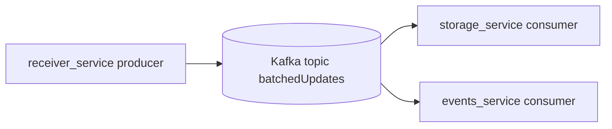

# Kafka Service (Docker) 🦉

Single-broker Kafka + Zookeeper stack used by this repo for async event flow.

## 📦 What This Service Does

- Hosts Kafka topic `batchedUpdates`
- Accepts producer writes from `receiver_service`
- Delivers the same stream to `storage_service` and `events_service`
- Supports internal container traffic on `kafka:9092`
- Supports host-only local access on `127.0.0.1:9093`

## 🧭 Topology (Mermaid)



## ✅ Hardening Phase 2 (Now Applied)

- Migrated from legacy `wurstmeister/*` images to maintained Confluent images:
  - `confluentinc/cp-zookeeper:7.6.1`
  - `confluentinc/cp-kafka:7.6.1`
- Added broker/zookeeper health checks and restart policy
- Kept listener behavior the same:
  - internal `kafka:9092`
  - host loopback `127.0.0.1:9093`
- Added `kafka_init` bootstrap job to create topic `batchedUpdates` if missing
- Added CI guardrails to block legacy images and insecure host binding

## ⚠️ Migration Note

This migration uses new Confluent data paths to avoid legacy data collisions:

- `./data/confluent/zookeeper/...`
- `./data/confluent/kafka/...`

Recommended rollout:

1. Stop old Kafka stack.
2. Back up existing `kafka/data/`.
3. Start new Kafka stack.
4. Validate producer/consumer flow.

For this MVP environment, topic recreation is acceptable if needed.

## 🚀 Quick Start

1. Ensure the shared external network exists:

```bash
docker network create kafka_default || true
```

1. Start Kafka stack:

```bash
cd Go/kafka
docker compose up -d
```

1. Verify status:

```bash
docker compose ps
docker compose logs --tail=100 kafka
docker compose logs --tail=100 zookeeper
```

## 🔌 Connection Modes

- From other containers on `kafka_default`: `kafka:9092`
- From host machine (local tooling only): `127.0.0.1:9093`

`9092` is intentionally not published to the host.

## ⚙️ Key Kafka Settings

- `KAFKA_LISTENERS="INTERNAL://0.0.0.0:9092,EXTERNAL://0.0.0.0:9093"`
- `KAFKA_ADVERTISED_LISTENERS="INTERNAL://kafka:9092,EXTERNAL://127.0.0.1:9093"`
- `KAFKA_AUTO_CREATE_TOPICS_ENABLE=true`
- `KAFKA_MESSAGE_MAX_BYTES=3145728`
- `KAFKA_REPLICA_FETCH_MAX_BYTES=3145728`

## 🛡️ Durability and Scale Notes

- `1` partition = simple single-lane throughput.
- `1` replica = no broker redundancy (expected with one broker).
- To increase fault tolerance, you need multi-broker Kafka.

## 🗂️ Directory Layout

```text
kafka/
|-- .gitignore
|-- docker-compose.yml
`-- data/
    `-- confluent/
        |-- kafka/
        `-- zookeeper/
            |-- data/
            `-- log/
```

## 🧪 Troubleshooting

- Kafka not healthy:
  - `docker compose logs kafka`
  - confirm `kafka_default` exists
- Producers cannot connect:
  - verify producer uses `kafka:9092` (container-to-container)
  - verify service is attached to `kafka_default`
- Host tooling cannot connect:
  - verify `127.0.0.1:9093` is not in use by another process
