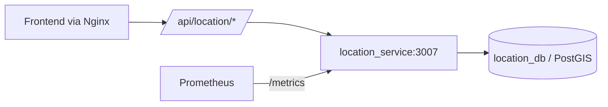
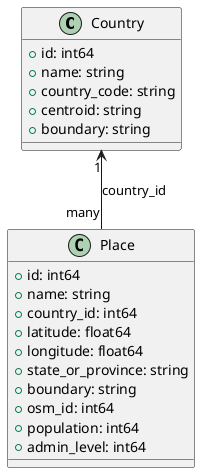

# 📍 Location Service (`location`)

Geospatial lookup service for Pokémon Go Nexus.  
Provides autocomplete, geocode, reverse geocode, and city boundary lookups from PostGIS.

## ✅ What It Does

- 🔎 `GET /autocomplete?query=<text>`
- 🧭 `GET /geocode?q=<text>` (also supports `query=<text>`)
- 🌐 `GET /reverse?lat=<float>&lon=<float>`
- 🗺️ `GET /city/:country/:state?/:name?`
- ❤️ `GET /healthz`
- 🚦 `GET /readyz`
- 📈 `GET /metrics`

## 🔐 Hardening Applied

- Upgraded Fiber to `v2.52.11` and pgx to `v5.8.0`
- Replaced wildcard CORS with allow-list CORS (`ALLOWED_ORIGINS`)
- Added request size limit (`MAX_BODY_BYTES`) and IP rate limiting
- Added readiness probe that verifies DB connectivity
- Added Prometheus metrics and endpoint
- Added request validation guards (length/range checks)
- Docker image now runs as non-root on Alpine

## ⚙️ Environment

Use `location/.env.example` as template.

| Variable | Required | Default | Purpose |
| --- | --- | --- | --- |
| `PORT` | No | `3007` | Service port |
| `SERVER_PORT` | No | `3007` | Backward-compatible port var |
| `DB_USER` | Yes | - | Postgres user |
| `DB_PASSWORD` | Yes | - | Postgres password |
| `DB_HOST` | Yes | - | Postgres host |
| `DB_PORT` | No | `5432` | Postgres port |
| `DB_NAME` | Yes | - | Postgres DB name |
| `POST_PASSWORD` | No | `DB_PASSWORD` | Password used by backup/restore Python scripts |
| `ALLOWED_ORIGINS` | No | localhost + prod domains | CORS allow list |
| `LOG_LEVEL` | No | `info` | `trace/debug/info/warn/error` |
| `RATE_LIMIT_MAX` | No | `180` | Requests per window per IP |
| `RATE_LIMIT_WINDOW_SEC` | No | `60` | Rate-limit window |
| `MAX_BODY_BYTES` | No | `1048576` | Request body limit |
| `DB_MAX_OPEN_CONNS` | No | `25` | DB pool max open |
| `DB_MIN_IDLE_CONNS` | No | `2` | DB pool min idle |
| `DB_CONN_MAX_IDLE_MIN` | No | `10` | DB conn idle lifetime |
| `DB_CONN_MAX_LIFETIME_MIN` | No | `60` | DB conn max lifetime |
| `DB_CONNECT_TIMEOUT_SEC` | No | `5` | DB connect timeout |

## 🧪 Run Locally

```bash
cd location
go mod tidy
go test ./...
go run .
```

Service default URL: `http://localhost:3007`

## 🐳 Docker Compose

```bash
cd location
docker compose --env-file .env up -d
```

- `location_service` binds `127.0.0.1:3007`
- `location_db` binds `127.0.0.1:5432`
- both join `kafka_default` network

## 💾 Backup Scripts

Python backup helpers in this folder read:

1. `POST_PASSWORD`
2. `DB_PASSWORD`
3. legacy `POST_PASSSWORD` (backward compatibility)

## 🔁 CI/CD

- CI: `.github/workflows/ci-location.yml`
- CD: `.github/workflows/deploy-location-prod.yml`

CD preflight checks:

- `location/.env` exists on prod
- required DB keys are present
- `kafka_default` Docker network exists
- compose renders cleanly

## 📊 Monitoring

Prometheus target:

- `job="location_service"` scraping `location_service:3007/metrics`

Alert rules added:

- `LocationServiceTargetDown`
- `LocationServiceHigh5xxRate`
- `LocationServiceHighP95Latency`
- `LocationServiceMetricsMissing`

## 🧭 Service Context (Mermaid)



## 🧱 Data Model (UML)


