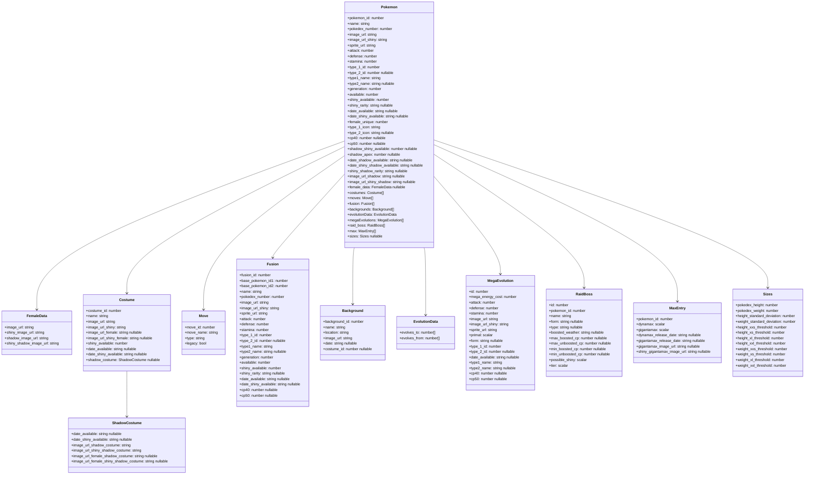

# Pokemon Data Service (Go) 🐉

Production Pokemon API service for Pokemon Go Nexus, implemented in Go (`net/http` + `chi`) as the replacement for the legacy Node `pokemon_data` runtime.

## ✨ Highlights

- Fast in-memory response cache for `/pokemon/pokemons` (JSON + gzip + ETag)
- Startup prewarm support for lower first-request latency
- Health and readiness probes for safer deploys
- Internal endpoint protection via CIDR allowlist
- Production CI/CD gates with rollback-aware deployment

## 🔌 Endpoints

- `GET /pokemon/pokemons`
- `GET /healthz`
- `GET /readyz`
- `GET /metrics` (internal-only when enabled)
- `GET /internal/cache/stats` (internal-only when enabled)
- `POST /internal/cache/refresh` (internal-only when enabled, optional token)

## ⚙️ Environment Variables

### Minimal Production `.env` (recommended)

```env
PORT=3001
SQLITE_PATH=./data/pokego.db
ALLOWED_ORIGINS=https://pokemongonexus.com,https://www.pokemongonexus.com
INTERNAL_ONLY_ENABLED=true
INTERNAL_ONLY_CIDRS=127.0.0.0/8,::1/128,172.30.0.11/32
TRUSTED_PROXY_CIDRS=127.0.0.0/8,::1/128,172.30.0.10/32
```

### Minimal Local Dev `.env` (recommended)

```env
PORT=3001
SQLITE_PATH=./data/pokego.db
ALLOWED_ORIGINS=http://localhost:3000,http://127.0.0.1:3000
INTERNAL_ONLY_ENABLED=false
```

### Optional Runtime Knobs (safe to omit)

- `NODE_ENV` (default `production`)
- `ENV` (legacy fallback if `NODE_ENV` is unset)
- `LOG_LEVEL` (`DEBUG`, `INFO`, `WARN`, `ERROR`; default `INFO`)
- `JSON_PRETTY` (default true outside production)
- `CACHE_PREWARM` (default `true`)
- `CACHE_BUILD_TIMEOUT` (default `60s`)
- `CACHE_REFRESH_TOKEN` (optional, protects manual cache refresh endpoint)
- `ALLOW_CLOUDFLARE_SUBDOMAINS` (default `true`)
- `RATE_LIMIT_ENABLED` (default true in production)
- `RATE_LIMIT_RPS` (default `5`)
- `RATE_LIMIT_BURST` (default `10`)

## 🧪 Local Run

```bash
cd Go/pokemon
go mod tidy
go run ./cmd/pokemon
```

Service default URL:

- `http://localhost:3001/pokemon/pokemons`

## 🐳 Docker + Networking

`pokemon`, `nginx`, and `monitoring` share a dedicated external Docker network named `pokemon_edge`.

Create once per host:

```bash
docker network create --driver bridge --subnet 172.30.0.0/24 --gateway 172.30.0.1 pokemon_edge
```

Compose:

```bash
cd Go/pokemon
docker compose up -d
```

## 📐 Architecture Diagrams

### 1) Request Path and Cache Lifecycle (Mermaid)


### 2) Prod Container Topology (Mermaid)


Kafka is not part of the Pokemon service request/data path. This service reads directly from SQLite and is called through nginx. `pokemon_edge` CIDR on prod is `172.30.0.0/24`.

### 3) CI -> CD -> Rollback Path (Mermaid)


### 4) UML Sequence: `GET /pokemon/pokemons` (Mermaid UML-style)


### 5) UML Class View: Core Components (Mermaid UML-style)


### 6) UML Data Model: `GET /pokemon/pokemons` (Mermaid UML-style)



`moves` objects include additional columns from the underlying `moves` table; the diagram shows guaranteed/normalized keys used by clients (`move_id`, `move_name`, `type`, `legacy`).

## 🚀 Deployment Notes

- Production deploy is automated via GitHub Actions manual CD (`deploy-pokemon-prod`).
- Service deploys from `Go/pokemon` and currently runs with container name `pokemon_data_container`.
- Existing image tags are pushed to `adamwentworth/pokemon_service_go`.
- Legacy Node `pokemon_data` image can be redeployed manually if rollback is ever needed.

## 🩺 Troubleshooting

- `502` from frontend usually means nginx upstream or Docker network mismatch.
- Failing readiness often means DB path/permissions issue on `./data/pokego.db`.
- Confirm health quickly:

```bash
curl -i http://localhost:3001/healthz
curl -i http://localhost:3001/readyz
```

## 📚 Operations

- Runbook: `pokemon/RUNBOOK.md`
- SQLite backup script: `pokemon/scripts/sqlite_backup.ps1`
- SQLite restore drill: `pokemon/scripts/sqlite_restore_drill.ps1`
