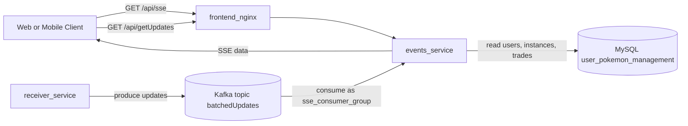
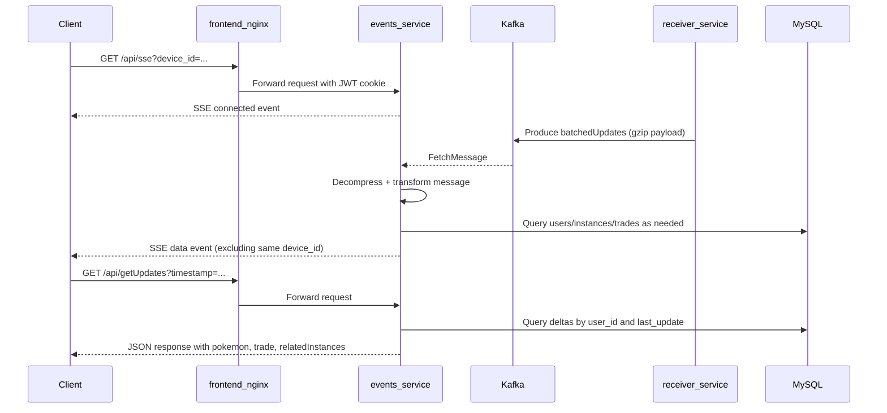
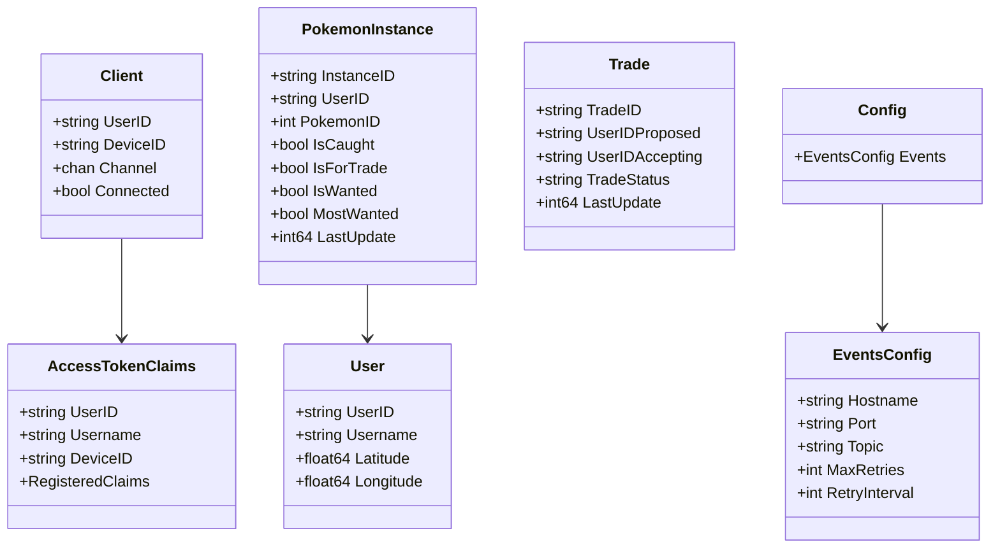

# 📡 Events Service (SSE + Kafka Reader)

Real-time reader service for client sync and live updates.

It:

- consumes `batchedUpdates` from Kafka
- streams live deltas to connected clients over SSE
- serves pull-based updates for reconnect/sync flows

## ✅ What This Service Does

- 🔐 Protects API routes with JWT cookie auth (`accessToken`)
- 🌐 Enforces CORS allowlist from `ALLOWED_ORIGINS`
- ❤️ Exposes `GET /healthz`, `GET /readyz`, and `GET /metrics`
- 📥 Consumes Kafka updates from topic `batchedUpdates`
- 📤 Broadcasts transformed updates to active SSE clients
- 🧠 Applies in-memory trade completion swap projection for SSE output
- 🐳 Runs as a loopback-bound container (`127.0.0.1:3008`)

## 🛣️ API Endpoints

| Method | Path | Auth | Purpose |
| --- | --- | --- | --- |
| GET | `/healthz` | No | Liveness check |
| GET | `/readyz` | No | Readiness check (DB ping) |
| GET | `/metrics` | No | Prometheus metrics endpoint |
| GET | `/api/sse?device_id=<id>` | Yes | Open SSE stream |
| GET | `/api/getUpdates?timestamp=<ms>&device_id=<id>` | Yes | Pull updates since timestamp |

## 🧭 Service Context (Mermaid)



## 🔄 Live Update Flow (UML Sequence)



## 🧱 Domain Model (UML Class)



## ⚙️ Configuration

Set `reader/events/.env`:

```env
PORT=3008
ALLOWED_ORIGINS=http://localhost:3000,http://127.0.0.1:3000,https://pokemongonexus.com,https://www.pokemongonexus.com

JWT_SECRET=...

DB_USER=adam
DB_PASSWORD=...
DB_HOSTNAME=mysql_storage
DB_PORT=3306
DB_NAME=user_pokemon_management

LOG_LEVEL=info

KAFKA_HOSTNAME=kafka
KAFKA_PORT=9092
KAFKA_TOPIC=batchedUpdates
KAFKA_MAX_RETRIES=5
KAFKA_RETRY_INTERVAL=3

# Backward-compatible fallback for older config readers
HOST_IP=127.0.0.1
```

Notes:

- `KAFKA_*` env vars override values from `config/app_conf.yml`.
- `HOST_IP` is only a backward-compatible fallback for Kafka hostname.
- `JWT_SECRET` is required for protected routes.

## 🧪 Quality Gates

Local checks:

```bash
cd reader/events
go test ./...
go test -cover ./...
go vet ./...
go run golang.org/x/vuln/cmd/govulncheck@latest ./...
```

CI:

- workflow: `.github/workflows/ci-events.yml`
- includes test, coverage gate, vet, govulncheck, Trivy scans, SBOM, optional DockerHub push

## 🚀 Run Locally

```bash
cd reader/events
go run .
```

## 🐳 Run With Docker Compose

```bash
cd reader/events
docker compose up -d
```

Compose behavior:

- binds to `127.0.0.1:3008`
- healthcheck hits `/readyz`
- joins external network `kafka_default`

## 🛠️ CD Workflow

- workflow: `.github/workflows/deploy-events-prod.yml`
- dispatch inputs:
  - `image_ref` (`latest`, `sha-<commit>`, or full image ref)
  - `deploy_root` (default `/media/adam/storage/Code/Go`)
  - `service_name` (default `events_service`)
- deploy behavior:
  - sync git repo on prod runner
  - preflight env/network checks
  - rollout with readiness check (`http://127.0.0.1:3008/readyz`)
  - auto rollback to previous image on failure

## 🔍 Quick Verification

```bash
curl -i http://127.0.0.1:3008/healthz
curl -i http://127.0.0.1:3008/readyz
curl -i http://127.0.0.1:3008/metrics
```
