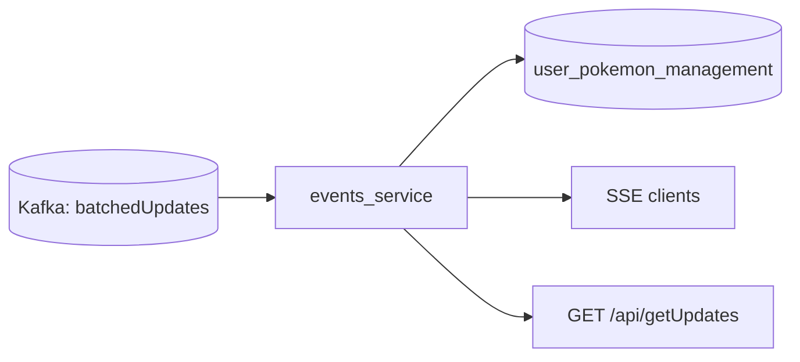

# Events Service (SSE + Kafka)

Real-time reader service that:

- Consumes `batchedUpdates` from Kafka
- Streams live deltas to clients over Server-Sent Events (SSE)
- Serves pull-based update snapshots for reconnect/sync flows

## Why Fiber here

Fiber is a good fit for this service because it is SSE-heavy and already integrated with your current middleware/runtime patterns. Migrating to chi/net/http would add risk with little immediate value for this path.

## Features

- JWT-protected routes using access token cookie (`accessToken`)
- SSE stream endpoint for real-time updates
- Pull endpoint (`getUpdates`) for timestamp-based sync
- In-memory trade-completion swap projection
- CORS allowlist via env (`ALLOWED_ORIGINS`)
- Health/readiness endpoints for deploy checks

## Endpoints

- `GET /healthz`
- `GET /readyz`
- `GET /api/sse?device_id=...` (JWT required)
- `GET /api/getUpdates?timestamp=...&device_id=...` (JWT required)

## Runtime Flow



## Environment

Create `reader/events/.env`:

```env
PORT=3008
ALLOWED_ORIGINS=http://localhost:3000,http://127.0.0.1:3000,https://pokemongonexus.com,https://www.pokemongonexus.com

JWT_SECRET=...

DB_USER=adam
DB_PASSWORD=...
DB_HOSTNAME=mysql_storage
DB_PORT=3306
DB_NAME=user_pokemon_management

KAFKA_HOSTNAME=kafka
KAFKA_PORT=9092
KAFKA_TOPIC=batchedUpdates
KAFKA_MAX_RETRIES=5
KAFKA_RETRY_INTERVAL=3

LOG_LEVEL=info
```

Notes:

- `HOST_IP` is still accepted as a backward-compatible fallback for Kafka host.
- Config defaults can come from `config/app_conf.yml`; env vars override those values.

## Local Run

```bash
cd reader/events
go mod tidy
go run .
```

## Docker Run

```bash
cd reader/events
docker compose up -d
```

Compose notes:

- Binds service on `127.0.0.1:3008`
- Uses external Docker network `kafka_default`
- Includes container healthcheck against `/readyz`

## Security + Hardening

- Updated to patched `github.com/gofiber/fiber/v2` and `github.com/golang-jwt/jwt/v4`
- Updated `golang.org/x/net` indirect dependency
- JWT parsing uses `ParseWithClaims` + strict HMAC method validation
- Rejects oversized token cookies
- Non-root runtime container image

## Basic Verification

```bash
# Unit/build checks
go test ./...
go vet ./...
go run golang.org/x/vuln/cmd/govulncheck@latest ./...

# Health checks
curl -i http://127.0.0.1:3008/healthz
curl -i http://127.0.0.1:3008/readyz
```
