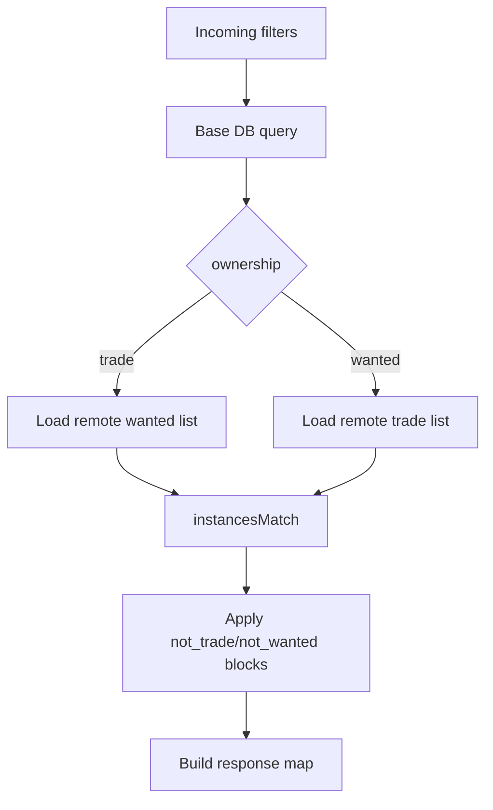

# 🔎 Search Service

Read-only search service that returns trade/wanted matches from the shared MySQL dataset.

## ✅ Current Status

- Framework: `Fiber v2` (kept intentionally)
- JWT auth hardened (`ParseWithClaims`, alg lock to HS256, claim checks)
- Dependabot issues addressed via dependency upgrades
- Health/readiness/metrics endpoints added
- CORS allow-list, request body-size, and rate-limits added
- CI/CD workflows added (`ci-search.yml`, `deploy-search-prod.yml`)

## 🧠 Why Fiber Here

Fiber is still a good fit for this service right now:

- You already run multiple reader services on Fiber (ops consistency).
- Handler/business logic in `pokemon_handlers.go` is dense and tuned.
- The security concerns were dependency-level and are now patched.
- Replatforming to `chi` today adds migration risk with little near-term gain.

## 🌐 Endpoints

- `GET /api/searchPokemon`
- `GET /api/searchPokemon/`
- `GET /healthz`
- `GET /readyz`
- `GET /metrics`

All search endpoints are JWT-protected (`accessToken` cookie).

## 🛡️ Runtime Guards

- `MAX_BODY_BYTES` (default `1048576`)
- `RATE_LIMIT_MAX` (default `120`)
- `RATE_LIMIT_WINDOW_SEC` (default `60`)
- CORS allow-list from `ALLOWED_ORIGINS`

## ⚙️ Required Env

| Key | Purpose |
| --- | --- |
| `PORT` | Service port (default `3006`) |
| `JWT_SECRET` | HS256 signing key for access token validation |
| `ALLOWED_ORIGINS` | Comma-separated CORS origins |
| `DB_USER` | MySQL username |
| `DB_PASSWORD` | MySQL password |
| `DB_HOSTNAME` | MySQL host |
| `DB_PORT` | MySQL port |
| `DB_NAME` | MySQL database |
| `LOG_LEVEL` | `trace/debug/info/warn/error` |
| `DB_MAX_OPEN_CONNS` | Optional DB pool max open |
| `DB_MAX_IDLE_CONNS` | Optional DB pool max idle |
| `DB_CONN_MAX_LIFETIME_MIN` | Optional DB conn lifetime (minutes) |

## 🧭 Request Flow

```mermaid
flowchart LR
  FE[Frontend] --> NGINX[/api/search/.../]
  NGINX --> DISC[search_service:3006]
  DISC --> AUTH[JWT Cookie Validation]
  AUTH --> SEARCH[SearchPokemonInstances]
  SEARCH --> MYSQL[(MySQL instances/users)]
  DISC --> METRICS[/metrics]
  METRICS --> PROM[Prometheus]
```

## 🔁 Matching Logic (Preserved)

`pokemon_handlers.go` core trade/wanted matching logic is preserved.  
The update only hardened auth/runtime and aligned ownership column usage with schema (`is_caught`).



## 📦 Local Run

```bash
cd reader/search
go test ./...
go run .
```

## 🐳 Container Run

```bash
cd reader/search
docker compose up -d search_service
docker compose logs -f search_service
```

