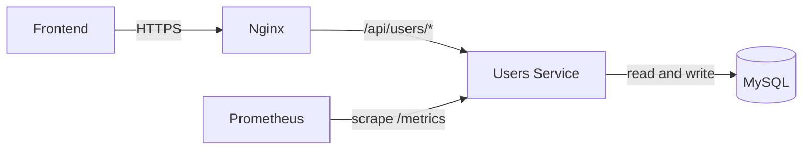
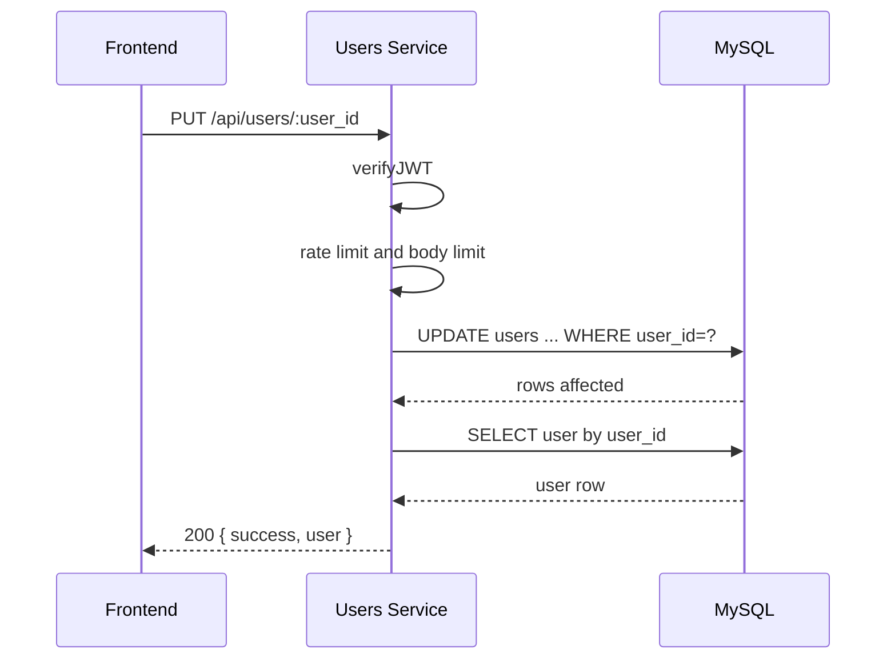
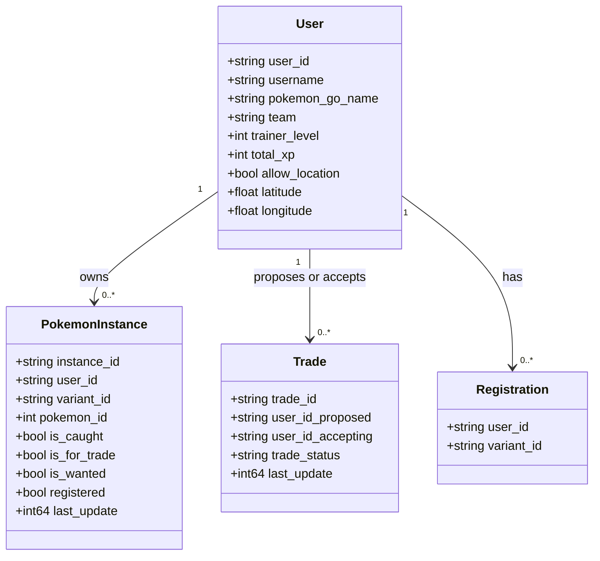
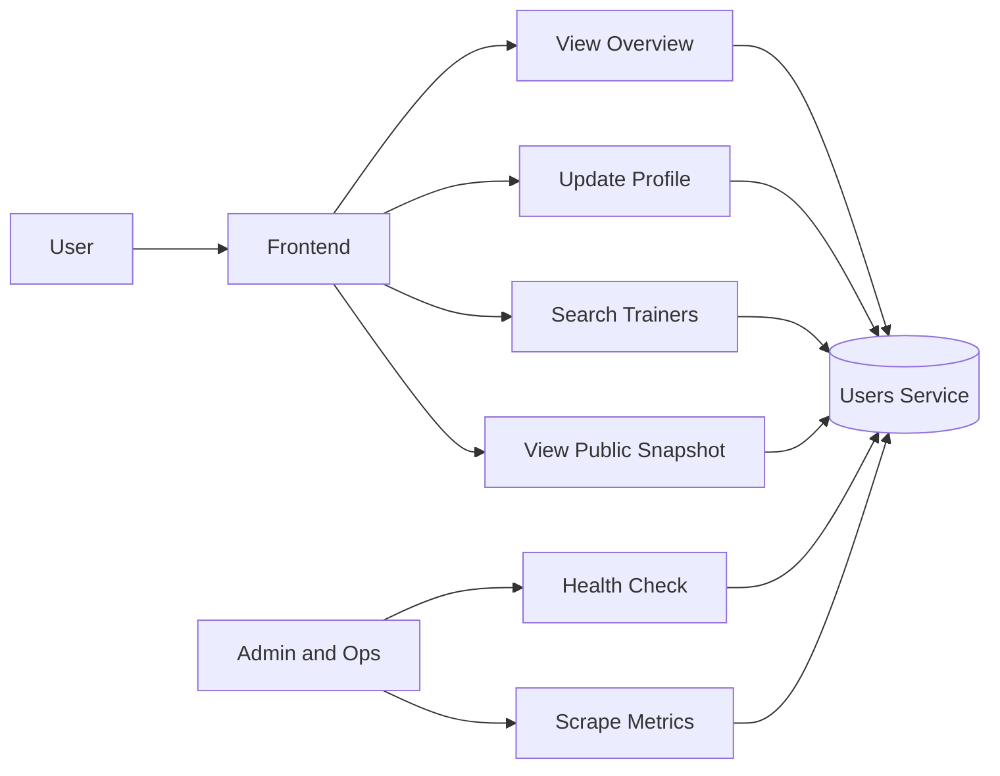
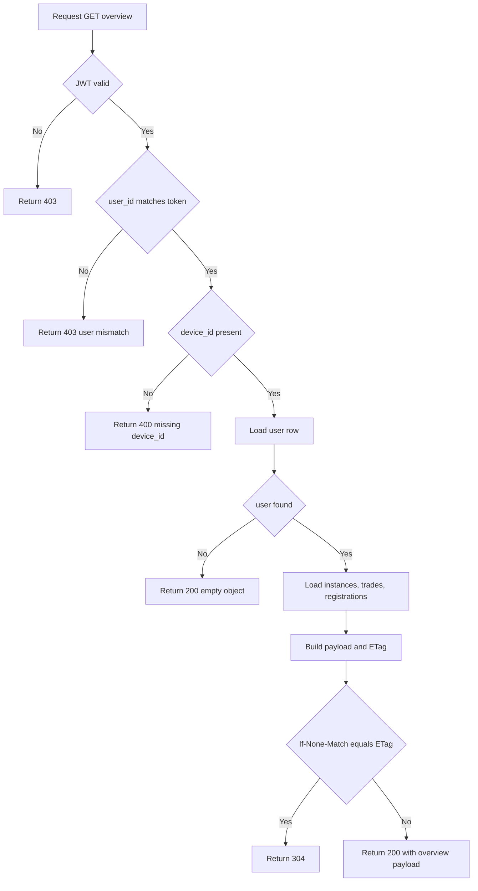
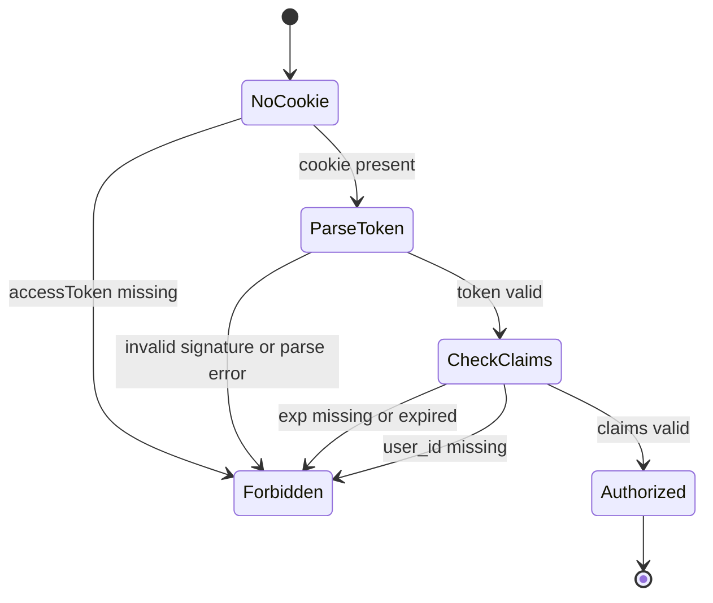
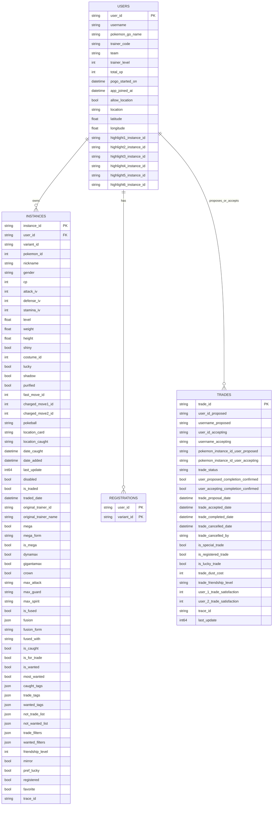

# 👤 Users Service

The users service provides profile and ownership-read APIs for the Pokemon app.
It runs as a JWT-protected API for user-specific endpoints and also exposes public trainer snapshots.

## 🎯 Responsibilities

- Serve authenticated user overview payloads (`user`, `pokemon_instances`, `trades`, `registrations`).
- Upsert user profile fields in MySQL.
- Serve public trainer snapshot data by username.
- Provide autocomplete suggestions for trainer search.
- Expose health and metrics endpoints for operations.

## 🏗️ Service Topology (Mermaid)



## 🔐 Protected Update Flow (Mermaid Sequence)



## 🧬 UML Domain Model (Mermaid Class Diagram)



## 🧭 UML Use-Case View (Mermaid)



## 🧪 UML Activity Diagram (Overview Request)



## 🔁 UML State Diagram (JWT Gate)



## 🗃️ UML Data Model (Mermaid ER)



## 🌐 Endpoints

### Public

- `GET /healthz`
- `GET /readyz`
- `GET /metrics`
- `GET /api/public/users/:username`
- `GET /api/users/public/users/:username` (compatibility path)
- `GET /api/autocomplete-trainers?q=<prefix>`

### Protected (JWT cookie required)

Canonical:

- `GET /api/users/:user_id/overview?device_id=<id>`
- `PUT /api/users/:user_id`

Compatibility:

- `GET /api/:user_id/overview?device_id=<id>`
- `PUT /api/:user_id`
- `PUT /api/update-user/:user_id`
- `PUT /api/users/update-user/:user_id`

## 🛡️ Security and Guardrails

- JWT parser restricts signing method to HS256 and validates required claims.
- Oversized auth cookie guard rejects very large `accessToken` values.
- CORS allow-list via `ALLOWED_ORIGINS`.
- Request body-size guard via `MAX_BODY_BYTES`.
- Per-user/IP rate limiting via `RATE_LIMIT_MAX` and `RATE_LIMIT_WINDOW_SEC`.
- Container runs as non-root user.

## ⚙️ Environment Variables

Required:

- `JWT_SECRET`
- `DB_USER`
- `DB_PASSWORD`
- `DB_HOSTNAME`
- `DB_PORT`
- `DB_NAME`

Common optional:

- `PORT` (default `3005`)
- `LOG_LEVEL` (default `info`)
- `ALLOWED_ORIGINS` (comma-separated)
- `MAX_BODY_BYTES` (default `1048576`)
- `RATE_LIMIT_MAX` (default `120`)
- `RATE_LIMIT_WINDOW_SEC` (default `60`)

DB pool tuning optional:

- `DB_MAX_OPEN_CONNS` (default `25`)
- `DB_MAX_IDLE_CONNS` (default `10`)
- `DB_CONN_MAX_LIFETIME_SEC` (default `300`)
- `DB_CONN_MAX_IDLE_TIME_SEC` (default `120`)

## 🧪 Testing

Run tests:

```bash
go test ./...
go vet ./...
```

Smoke checks (Linux or macOS):

```bash
BASE_URL=http://127.0.0.1:3005 ./scripts/smoke-users.sh
```

Smoke checks (PowerShell):

```powershell
.\scripts\smoke-users.ps1 -BaseUrl "http://127.0.0.1:3005"
```

Optional protected checks:

- Provide `USER_ID` and `ACCESS_TOKEN` in bash.
- Provide `-UserId` and `-AccessToken` in PowerShell.

## 🐳 Docker

```bash
docker compose up -d users_service
```

Default local bind:

- `127.0.0.1:3005:3005`

## 📈 Monitoring

- Prometheus should scrape `users_service:3005/metrics`.
- Alert rules for users service live in `monitoring/alerts.yml`.

## 📝 Notes

- Compatibility routes exist to support current frontend and nginx rewrite behavior.
