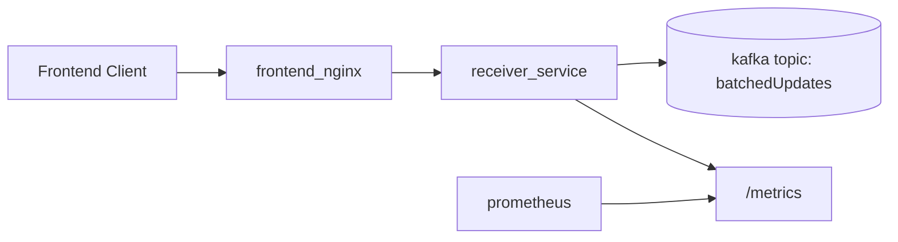
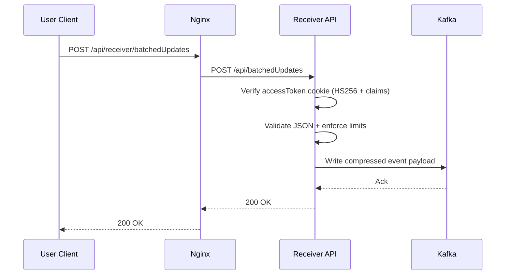
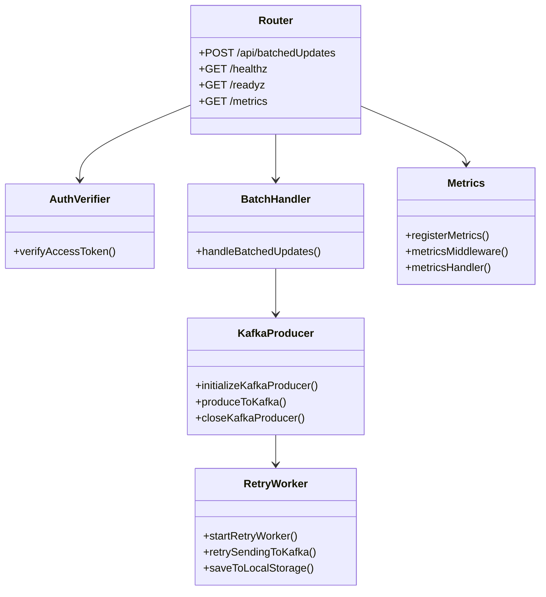
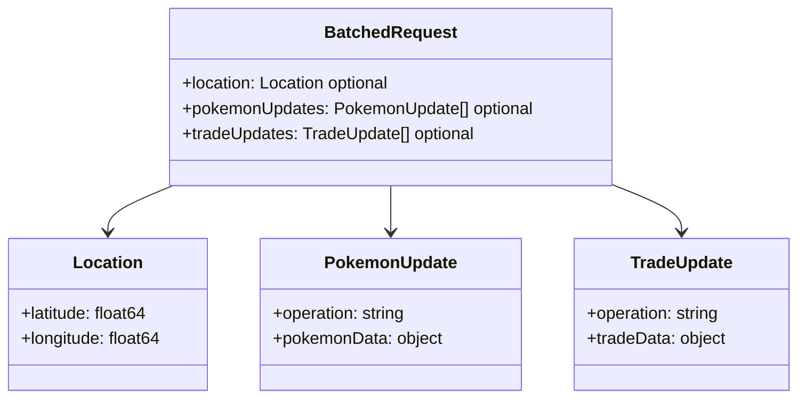

# Receiver Service (Go + Fiber) 📦

Receives batched client updates and publishes them to Kafka topic `batchedUpdates`.

## ✅ Current Production Posture

- Dependency vulnerabilities remediated (`fiber`, `jwt/v4`, `x/net`)
- Strict JWT verification (HS256, `exp` required, required user claims)
- Safer JSON decoding using Go stdlib (no `BodyParser` path)
- Request body limit (`10MB`) and per-batch update limits (`5000`)
- Health and readiness endpoints for deploy automation
- Graceful shutdown and Kafka producer close on SIGTERM/SIGINT
- Retry worker for unsent payload file (`pending_kafka_data.json`)
- CI with tests, vet, govulncheck, Trivy, and SBOM
- Manual CD with health-check + rollback workflow

## 🧭 Architecture (Mermaid)

### Service Context



### Ingest + Publish Flow



## 📐 UML Views

| Diagram | Purpose |
| --- | --- |
| Component UML | High-level module responsibilities |
| Payload UML | Ingest contract structure |

### Component UML (Mermaid Class Diagram)



### Payload UML (Mermaid Class Diagram)



## 🔌 Endpoints

- `POST /api/batchedUpdates`
- `GET /healthz`
- `GET /readyz`
- `GET /metrics`

## 🔐 Authentication

The service validates `accessToken` cookie and requires:

- valid HS256 signature
- `exp` claim present and valid
- `user_id`, `username`, and `device_id` claims

Invalid tokens return `401 Unauthorized`.

## 📨 Batch Request Shape

```json
{
  "location": { "latitude": 0, "longitude": 0 },
  "pokemonUpdates": [],
  "tradeUpdates": []
}
```

Notes:

- `location`, `pokemonUpdates`, and `tradeUpdates` are optional.
- Missing update arrays are normalized to empty arrays.
- Requests with >`5000` entries in either update array are rejected (`413`).

## ⚙️ Configuration

### Environment (`receiver/.env`)

Required:

- `JWT_SECRET`

Optional:

- `PORT` (default `3003`)
- `ALLOWED_ORIGINS` (comma-separated CORS list)
- `HOST_IP` (advanced override for Kafka hostname; usually not needed in Docker)

### Kafka config (`receiver/config/app_conf.yml`)

```yaml
events:
  hostname: "kafka"
  port: "9092"
  topic: "batchedUpdates"
  max_retries: 5
  retry_interval: 3
```

If config file is missing, safe defaults are used.

## 🐳 Docker

```bash
cd Go/receiver
docker compose up -d
```

Container:

- listens on `3003`
- host exposure is loopback-only: `127.0.0.1:3003`
- joins `kafka_default` network

## 🧪 Local Checks

```bash
cd Go/receiver
go test ./...
go vet ./...
govulncheck ./...
```

## 🚀 CI/CD

Workflows:

- CI: `.github/workflows/receiver-ci.yml`
- Deploy: `.github/workflows/deploy-receiver-prod.yml`

Deploy workflow behavior:

- syncs prod repo to selected branch
- validates `receiver/.env` (`JWT_SECRET` required)
- pulls selected image
- recreates `receiver_service`
- verifies `GET /readyz` on `127.0.0.1:3003`
- rolls back to previous image on failure (if available)

## 📈 Fiber Decision

Fiber is still a valid production choice in 2026.
What matters is operational hardening (tests, vuln patching, health checks, resource limits, and observability), which this service now has.
