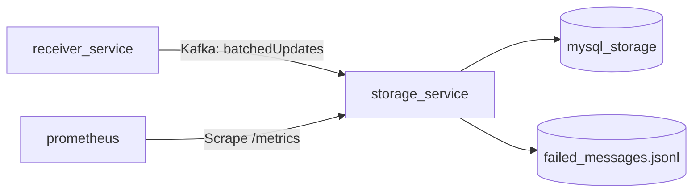
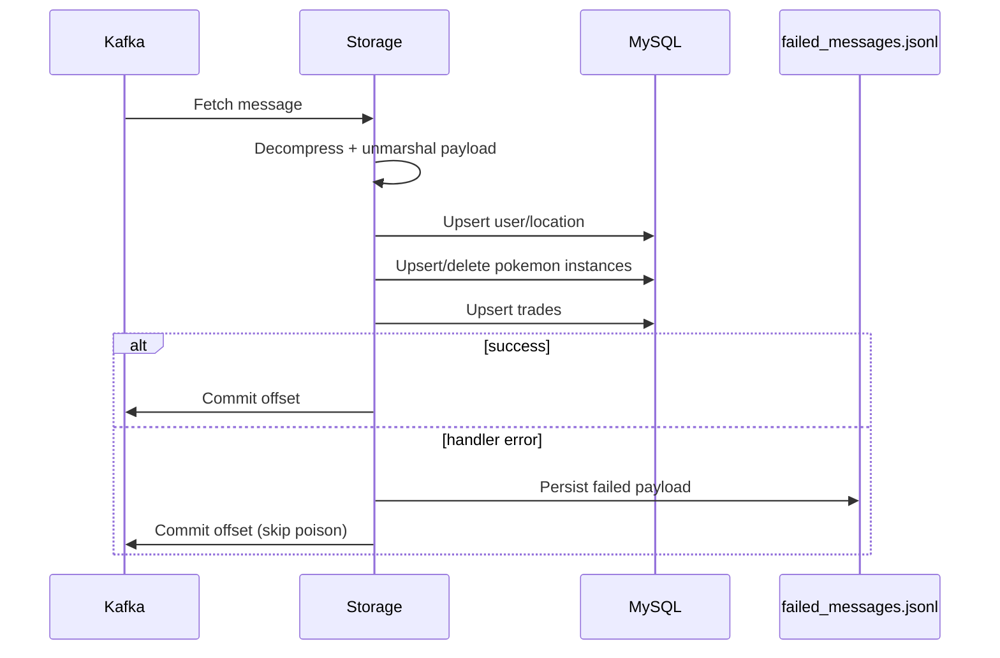
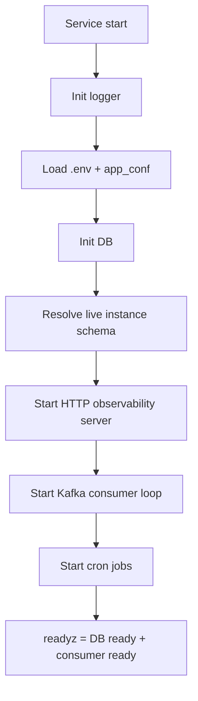
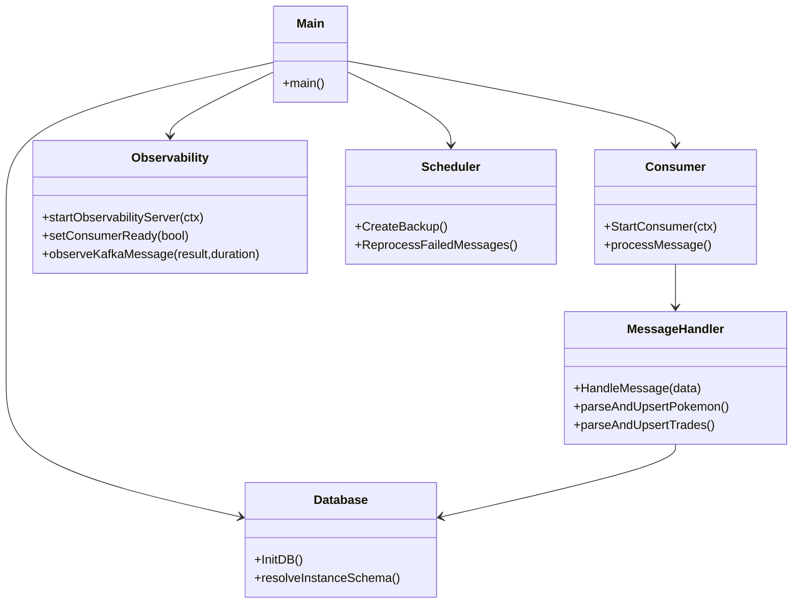
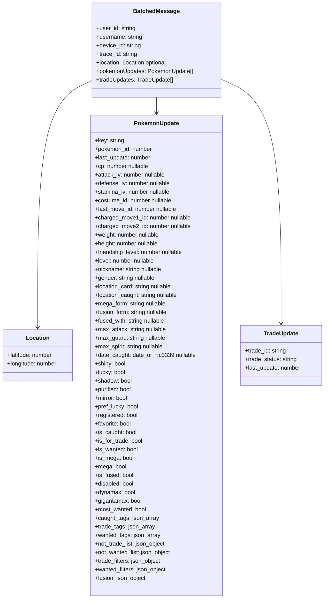
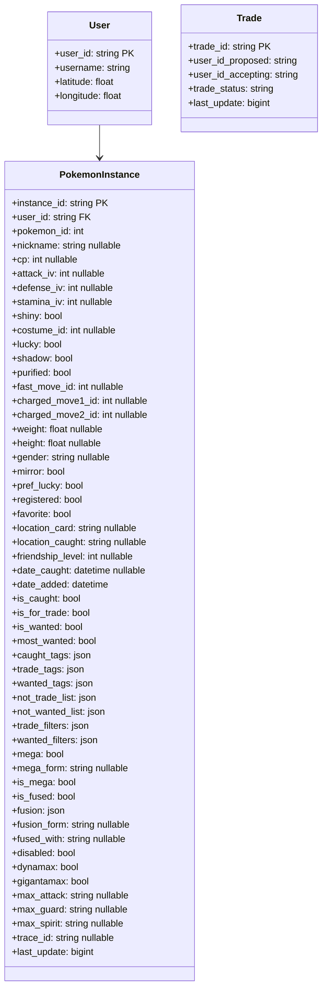

# Storage Service (Go Worker + Observability) 🗃️

Consumes batched updates from Kafka, applies ownership/trade mutations, and persists to MySQL.

## ✅ Current Production Scope

- Kafka consumer for `batchedUpdates`
- Upsert/delete logic for Pokemon instances
- Trade upsert + conflict handling
- Auto-sync for `registrations` and `instance_tags`
- Retry file for failed poison messages
- In-app daily backup schedule at midnight (enabled by default)
- Health/readiness/metrics HTTP server (`:3004` by default)

## 🔌 Endpoints

- `GET /healthz`
- `GET /readyz`
- `GET /metrics`

## 🧭 Architecture (Mermaid)

### Service Context



### Consume + Persist Flow



### Startup + Readiness



## 📐 UML Views

| Diagram | Purpose |
| --- | --- |
| Component UML | Core runtime modules and dependencies |
| Payload UML | Kafka message contract |
| Data UML | Main persisted entities |

### Component UML (Mermaid Class Diagram)



### Payload UML (Mermaid Class Diagram)



### Pokemon Instance Write Contract (Storage Parse Surface)

The storage worker currently parses/persists the following Pokemon instance fields.

| Category | Fields |
| --- | --- |
| Identity and ordering | `key` (maps to `instance_id`), `variant_id`, `pokemon_id`, `last_update` |
| Ownership flags | `is_caught`, `is_for_trade`, `is_wanted`, `most_wanted` |
| Core stats | `cp`, `attack_iv`, `defense_iv`, `stamina_iv`, `level` |
| Base attributes | `nickname`, `gender`, `shiny`, `costume_id`, `lucky`, `shadow`, `purified` |
| Moves | `fast_move_id`, `charged_move1_id`, `charged_move2_id` |
| Dimensions | `weight`, `height` |
| Trade preferences | `mirror`, `pref_lucky`, `registered`, `favorite`, `friendship_level` |
| Tags and lists | `caught_tags`, `trade_tags`, `wanted_tags`, `not_trade_list`, `not_wanted_list`, `trade_filters`, `wanted_filters` |
| Mega, fusion, max | `mega`, `mega_form`, `is_mega`, `is_fused`, `fusion`, `fusion_form`, `fused_with`, `dynamax`, `gigantamax`, `max_attack`, `max_guard`, `max_spirit` |
| Location and dates | `location_card`, `location_caught`, `date_caught`, `traded_date` |
| Provenance and lifecycle | `pokeball`, `is_traded`, `original_trainer_name`, `original_trainer_id`, `crown` |
| Service metadata | `trace_id` (from top-level message), `user_id` (from top-level message), `date_added` (set by storage on create) |

Behavior notes:

- Deletion path is triggered only when `is_caught=false` and both `is_wanted` and `is_for_trade` are false.
- `is_caught` is required in incoming `pokemonUpdates`; rows missing it are skipped.
- Wanted rows are retained when `is_caught=false` and `is_wanted=true`.
- `is_for_trade` is automatically forced to `false` when `is_caught=false`.
- `registered` is automatically forced to `true` when `is_caught=true`.
- Storage enforces canonical ownership semantics using `is_caught` only.
- `registrations` is synchronized per `(user_id, variant_id)` from persisted instance state.
- `instance_tags` is synchronized from `caught_tags` + `trade_tags` + `wanted_tags` (filtered to valid user tag IDs).
- Unknown columns are filtered out at runtime via live `instances` schema inspection.
- JSON object fields default to `{}` when missing/invalid.
- JSON array tag fields default to `[]` when missing/invalid.

Fields that may appear from clients but are currently ignored by storage include:
none in the current canonical payload surface.

### Data UML (Mermaid Class Diagram)



## ⚙️ Configuration

### Required (`storage/.env`)

- `DB_USER`
- `DB_PASSWORD`
- `DB_HOSTNAME`
- `DB_PORT`
- `DB_NAME`
- `KAFKA_HOSTNAME`
- `KAFKA_PORT`
- `KAFKA_TOPIC`

### Recommended

- `KAFKA_MAX_RETRIES` (default `5`)
- `KAFKA_RETRY_INTERVAL` (default `3`)
- `PORT` or `STORAGE_HTTP_PORT` (default `3004`)
- `RUN_APP_BACKUPS` (default enabled; set `false` to disable app-managed backups)

### Optional YAML

- `storage/config/app_conf.yml` can define Kafka defaults.
- `.env` values override YAML values.

## 🐳 Docker

```bash
cd Go/storage
docker compose up -d
```

Notes:

- `storage_service` joins `kafka_default`
- `mysql_storage` runs in same compose
- storage healthcheck uses `http://127.0.0.1:3004/readyz`

## 📈 Metrics

Application metrics:

- `http_requests_total`
- `http_request_duration_seconds`
- `storage_kafka_messages_total{result=...}`
- `storage_kafka_message_processing_duration_seconds{result=...}`
- `storage_kafka_consumer_ready`

## 🚀 CI/CD

- CI: `.github/workflows/ci-storage.yml`
- Deploy: `.github/workflows/deploy-storage-prod.yml`

Deploy workflow includes:

- prod repo sync
- preflight env/compose/network checks
- deploy with selected image
- process-health validation
- rollback on failure

## 🔐 Security Notes

- No public ingress required for core worker path (Kafka + MySQL only)
- Message processing validates schema and ownership constraints
- Poison messages are persisted and skipped to avoid partition deadlock
- Service logs retain `trace_id` for cross-service correlation
